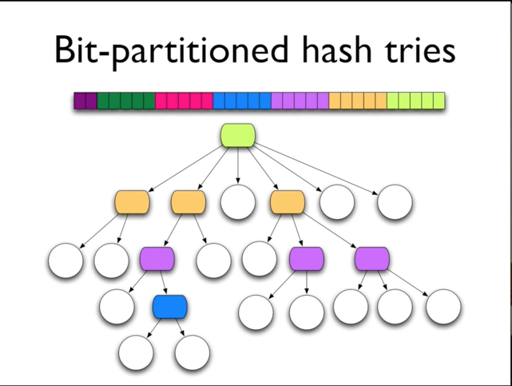
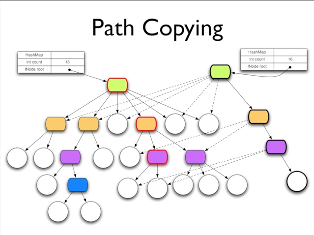

Clojure

A Dynamic Programming Language for the JVM

Concurrency Support

Rich Hickey

---
Agenda

- Introduction
- Feature Tour
- Shared state, multithreading and locks
- Refs, Transactions, and Agents
- Walkthrough - Multithreaded ant colony simulation
- Q & A

----
Introduction

- Who are you?
  - Know/use Lisp?
  - Java/C#/Scala?
  - ML/Haskell?
  - Python, Ruby, Groovy?
  - Clojure?
- Any multithreaded programming?

----
Clojure Fundamentals

- Functional
  - Immutable, persistent data structures
  - No mutable local variables
- Lisp
  - Not CL or Scheme
- Hosted on, and embracing, the JVM
- Supporting Concurrency
- Open Source

----
Clojure Features

- Dynamic development  ダイナミックな開発
  - REPL, reader, on-the-fly compilation to JVM bytecode
- Primitives - numbers, including arbitary-precision integers & ratios, characters, strings, symbols, keywords, regexes  プリミティブ - 任意精度の整数と比率、文字、文字列、シンボル、キーワード、正規表現などの数値
- Aggregates - lists, maps, sets, vectors  集計 - リスト、マップ、セット、ベクトル
  - read-able, persistent, immutable, extensible  読み取り可能、永続的、不変、拡張可能
- Abstract sequences + library  抽象シーケンス+ライブラリ
- Metadata   メタデータ
- First-class functions (fn), closures  ファーストクラス関数（fn）、クロージャ
- Recursive functional looping  再帰的な機能のループ
- Destructuring binding in let/fn/loop  let / fn / loopでの結合の破壊
- List comprehensions (for)  リスト内包（for）
- Macros  マクロ
- Multimethods  マルチメソッド
- Concurrency support  並行処理のサポート
- Java interop  Java相互運用性
  - Call methods, access fields, arrays  メソッドの呼び出し、フィールドへのアクセス、配列の呼び出し
  - Proxy interfaces/classes  プロキシインタフェース/クラス
  - Sequence functions extended to Java strings, arrays, Collections  シーケンス関数をJava文字列、配列、コレクションに拡張
  - Clojure data structures implement Collection/Callable/Iterable/Comparable etc where appropriate  Clojureデータ構造は、必要に応じてCollection / Callable / Iterable / Comparableなどを実装します
- Namespaces, zippers, XML and more!  名前空間、ジッパー、XMLなど

----
State - You're doing it wrong   - それは間違っている

- Mutable objects are the new spaghetti code  可変オブジェクトは新しいスパゲッティコードです
  - Hard to understand, test, reason about  理解するのが難しい、テストする、理由がある
  - Concurrency disaster  並行性障害
  - Terrible default architecture (Java/C#/Python/Ruby/Groovy/CLOS...)  ひどいデフォルトアーキテクチャ（Java / C＃/ Python / Ruby / Groovy / CLOS ...）
- Doing the right thing is very difficult  正しいことをすることは非常に難しい
  - Languages matter!  言語は重要です！

----
Concurrency
同時実行性

- Interleaved/simultaneous execution インターリーブ/同時実行
- Must avoid seeing/yielding inconsistent data 一貫性のないデータの表示/拒否を避けなければならない
- The more components there are to the data, the more difficult to keep consistent  データに対するコンポーネントが多くなればなるほど、一貫性を維持することが難しくなります
- The more steps in a logical change, the more difficult to keep consistent  論理的な変更のステップが増えるほど、一貫性を維持することが難しくなります
- Opportunities for automatic parallelism  自動並列処理の機会
  - Emphasis here on coordination  ここでのコーディネーションの強調

----
Explicit Locks  明示的なロック

- lock/synchronized (coll){...}  ロック/同期
- Only one thread can have the lock, others  block  1つのスレッドのみがロックを持つことができ、他のスレッドはブロックすることができます
- Requires coordination  調整が必要
  - All code that performs non-atomic access to coll must put that in a lock block  collへの非アトミックアクセスを実行するすべてのコードは、ロックブロックにそのコードを配置する必要があります
  - Synchronized handles single-method jobs only  同期は単一メソッドジョブのみを処理します

----
Single Lock Problems  単一ロックの問題

- Can't enforce coordination via language/code  言語/コードによる調整を強制できません
  - This is not a small problem  これは小さな問題ではない
- Even when correct, can cause throughput bottleneck on multi-CPU machines  たとえ正しい場合でも、マルチCPUマシンでスループットのボトルネックが発生する可能性があります
  - Your app is running on a multi-CPU machine  あなたのアプリはマルチCPUマシンで動作しています
  - Readers block readers  読者は読者をブロックする

----
Enhancing Read Parallelism  読取り並列性の向上

- Multi-reader/single-writer locks マルチリーダ/シングルライタロック
  - Readers don't block each other  読者はお互いをブロックしない
  - One writer at a time  一度に1人の作家
  - Writers wait for reader(s)  作家は読者を待っている

----
Copy On Write Collections  書込みコピーのコピー

- Reads get a snapshot  スナップショットを読み込みます
- Lock-free reading  ロックフリーの読書
- Atomic writes  原子書き込み
- Internally, copy the representation and swap it  内部的には、表現をコピーしてスワップする
  - Writes can be expensive (copying) 書き込みは高価（コピー）
- Multi-step writes still require locks  マルチステップ書き込みにはまだロックが必要です

----
Persistent Data Structures  永続的なデータ構造

- Immutable, + old version of the collection is still available after 'changes'  コレクションの変更不可能な古いバージョンは、 '変更'の後も引き続き使用できます
- Collection maintains its performance guarantees for most operations  コレクションは、ほとんどの操作でパフォーマンスの保証を維持します
  - Therefore new versions are not full copies  したがって、新しいバージョンはフルコピーではありません
- All Clojure data structures persistent  すべてのClojureデータ構造は永続的です
  - Hash map and vector both based upon array mapped hash tries (Bagwell)  ハッシュマップとベクトルの両方は、配列マップハッシュトライ（Bagwell）に基づいています。
  - Sorted map is red-black tree  ソートマップは赤 - 黒のツリーです

---

----

----
Structural Sharing  構造的共有

- Key to efficient 'copies' and therefore persistence  効率的な「コピー」とそのための永続性の鍵
- Everything is final so no chance of interference  すべてが最終的なので、干渉の可能性はない
- Thread safe  スレッドセーフ
- Iteration safe  反復安全

----
Multi-component change  複数コンポーネントの変更

- Perceding was the easy part  先行するのは簡単な部分だった
- Many logical activities involve multiple data structures/multiple steps  多くの論理的活動は、複数のデータ構造/複数のステップ
- Two locking options  2つのロックオプション
  - Coarse granularity locks  粗粒度ロック
  - Fine granularity locks  ファイン粒度ロック

----
Coarse Granularity Locking  粗粒度ロック

- Create external Lock representing a set of data structures  一連のデータ構造を表す外部ロックを作成する
- Clients must obtail a lock to maiipulate any of the structures  クライアントは、構造体のいずれかを操作するためにロックを取得する必要があります
- Each multi-part logical operation requires only one lock  各マルチパート論理演算に必要なロックは1つだけです

----
Coarse Granularity Locking  粗粒度ロック

x Safest  最も安全な
- Can be confusing as to what constitutes the set(s), what needs to be locked  セットを構成するもの、ロックする必要があるものを混乱させる可能性があります
  - X needs a/b/c, Y needs b/c/d  Xはa / b / cを必要とし、Yはb / c / dを必要とする
- Least throughput  最低スループット
  - Possible needless blocking  可能性のある不要なブロック
- Should read lock?  ロックを読みますか？

----
Fine Granularity Locking  ファイン粒度ロック

- Use locks on data structures themselves  データ構造自体にロックを使用する
- Clients must obtain a lock on each of the structures  クライアントは、各構造のロックを取得する必要があります
- A multi-part logical operation may require several locks  複数パートの論理操作では、複数のロックが必要になることがあります

----
Fine Granularity Locking  ファイン粒度ロック

- Dangerous  危険な
- Locking order is critical  ロックの順序は重要です
  - X locks a/b, Y locks b/a - deadlock possible  Xロックa / b、Yロックb / a - デッドロック可能
  - Very difficult to enforce locking order  ロック命令を実行するのは非常に難しい
- Best throughput 最高のスループット
  - Minimal blocking  最小限のブロック
- Should reads lock?  読み込みをロックする必要がありますか？
---
Concurrency Methods  並行処理メソッド

- Conventional way:  従来の方法：
  - Direct references to mutable objects  可変オブジェクトへの直接参照
  - Lock and pray (manual/convention)  ロックと祈り（手動/大会）
- Clojure way:  Clojure方法：
  - Indirect references to immutable persistent data structures 不変永続データ構造への間接参照
  - Concurrency semantics for references 参照の同時実行セマンティクス
    - Automatic/enforced 自動/強制
    - No locks! ロックなし！

----
Clojure References Clojure参考文献

- The only things that mutate are references themselves, in a controlled way 突然変異する唯一の事柄は、制御された方法で参照自体です
- 3 types of mutable references 3種類の可変参照
  - Vars - Isolate changes within threads スレッド内の変更を分離する
  - Refs - Share synchronous coordinated changes between threads 同期された調整済みの変更をスレッド間で共有する
  - Agents - Share asynchronous independent changes between threads スレッド間の非同期の独立した変更を共有する

----
Vars

- Like Common Lisp's special vars Common Lispの特別なvarsのように
  - dynamic scope  ダイナミックスコープ
  - stack discipline  スタック規律
- Shared root binding established by def  defによって確立された共有ルートバインディング
  - root can be unbound  ルートはアンバインドすることができます
- Can be changed (via set!) but only if first thread-locally bound using binding  （バインドを使用して最初にスレッドローカルにバインドされている場合のみ）
- Functions stored in vars, so they too can be dynamically rebound  varsに格納されている関数なので、動的にリバウンドすることもできます
  - context/aspect-like idioms コンテキスト/アスペクトのようなイディオム

----
Refs and Transactions

- Software transactional memory system (STM) ソフトウェアトランザクションメモリシステム（STM）
- Refs can only be changed within a transaction  参照はトランザクション内でのみ変更することができます
- All changes are Atomic and Isolated  すべての変更は原子と孤立です
  - Every change to Refs made within a transaction occurs or none do  トランザクション内で行われたRefへのすべての変更が発生するかどうか
  - No transaction sees the effects of any other transaction while it is running  実行中のトランザクションは、他のトランザクションの影響を認識しません
- Transactions are speculative  トランザクションは投機的です
  - Will be retried automatically if conflict  競合が発生すると自動的に再試行されます
  - Must avoid side-effects!  副作用を避けなければならない！

----
The Clojure STM

- Surround code with (dosync ...)  
- Uses Multiversion Concurrency Control (MVCC)  マルチバージョン同時実行制御（MVCC）を使用
- All reads of Refs will see a consistent snapshot of the 'Ref world' as of the starting point of the transaction, + any changes it has made.Refsのすべての読み取りには、トランザクションの開始点として+ 'Ref World'の一貫したスナップショットが表示されます。
- All changes made to Refs during a transaction will appear to occur at a single point in the timeline.  トランザクション中にRefsに加えられたすべての変更は、タイムライン内の単一のポイントで発生するように見えます。
- Readers never block writers/readers, writers never block readers, supports commute  読者は決してライター/読者をブロックせず、作家は決して読者をブロックせず、通勤をサポートします

----
Agents

- Manage independent state  独立した状態を管理する
- State changes through actions, which are ordinary functions (state => new-state)  通常の機能であるアクションによる状態の変化
- Actions are dispatched using send or send-off, which return immediately  アクションはsendまたはsend-offを使用して送出され、即座に戻ります。
- Actions occur asynchronously on thread-pool threads  スレッドプールスレッドでアクションが非同期に発生する
- Only one action per agent happens at a time  一度に1エージェントあたり1つのアクションしか発生しません

----
Agents

- Agent state always accessible, via deref/@, but may not reflect all actions  エージェントの状態は常にderef / @によってアクセス可能ですが、すべてのアクションを反映していない可能性があります
- Can coordinate with actions using await  awaitを使用してアクションを調整できます
- Any dispatches made during an action are held until after the state of the agent has changed  アクション中に行われたディスパッチは、エージェントの状態が変更されるまで保持されます
- Agents coordinate with transactions - any dispatches made during a transaction are held until it commits  エージェントは取引と調整を行います。取引中に行われたディスパッチは、コミットするまで保持されます
- Agents are not Actors (Erlang/Scala)

----
Walkthrough  

- Ant colony simulation
- World populated with food and ants  食物とアリが住む世界
- Ants find food, bring home, drop pheromones  アリは食べ物を見つけ、家に持ち帰り、フェロモンを落とす
- Sense pheromones, food, home  センスフェロモン、食品、家庭
- Ants act independently, on multiple real threads  複数の実際のスレッドでAntが独立して動作する
- Model pheromone evaporation  モデルフェロモン蒸発
- Animated GUI  アニメーションGUI
- < 250 lines of Clojure

----
