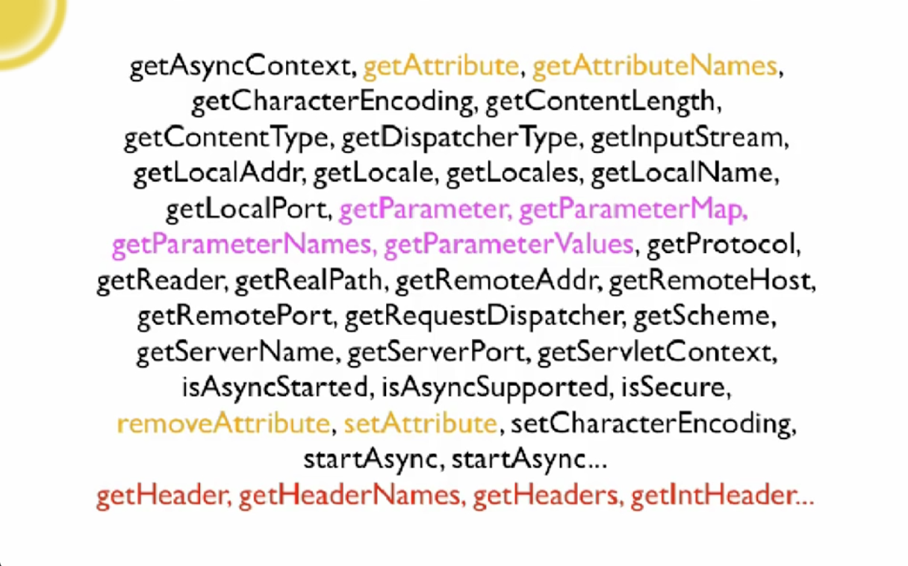

Clojure, Made Simple

Rich Hickey

---
Me

- Creator of Clojure
- Designer of Datomic
- CTO/Co-Founder Cognitect.Inc
- Two decades delivering commercial production apps in C++/Java/C#

---
You

- (dis)contented Java dev?
   (不)満足なJava開発?
- Clojure tinkerer?
  'wish I could use it at work'
- Clojure user
- Couldn't get into Brian Goetz' talk

---
Clojure

- Programming language for JVM, JavaScript et al
- Released in 2007
- Lisp, functional, data-oriented etc(more later)

---
"A lot of the best programmers and the most productive programmers I know are writing everything in ___ and swearing by it, and then just producting ridiculously sophisticated things in a very short time. And that programmer productivity matters."
Adrian Cockcroft - Battery Ventures, formerly Cloud Architect, Netflix

---
"A lot of the best programmers and the most productive programmers I know are writing everything in **Clojure** and swearing by it, and then just producting ridiculously sophisticated things in a very short time. And that programmer productivity matters."

「私が知っている最高のプログラマと最も生産的なプログラマの多くは、** Clojure **ですべてを書いており、それによって誓いをつけていて、非常に短時間でばかげて洗練されたものを生産しています。 そしてそのプログラマーの生産性は重要です。」

Adrian Cockcroft

http://thenewstack.io/the-new-stack-makers-adrian-cockcroft-on-sun-netflix-clojure-go-docker-and-more/


---
Programming is an Economic Activity

- Cost/benefit (コスト/利益)
- ROI (Return On Investment/投資対効果/投資収益率)
- Time to market (市場投入までの時間)
- Profit (利益)

---
Stakeholders Want

- Something good
- Soon

---
Something Good

- ~~Passes all tests~~
- ~~Type checks~~
 **Programmer-centric means, not ends**
- Does what it is supposed to do (それが何をすべきか)
- Meets operational requirements (運用要件を満たす)
- Is flexible enough to accommodate change (変化に対応できる柔軟性)

---
Does what it is Supposed To Do?

- From the perspective of the stakeholders (ステークホルダーの視点から)
- Very difficult to determine if a large, elaborate stateful program does what it is supposed to do (大規模で精巧なステートフルなプログラムが何をすべきかを判断するのは非常に難しい)
- Very difficult to determine if large or elaborate or stateful programs do what they are supposed to do (大規模で精巧なプログラムやステートフルなプログラムが、自分がやるべきことをしているのかどうかを判断することは非常に難しい)
---
Meets Operational Requirements

- Deployment/environment(配備/環境)  <- Shared with Java/
- Security                          <- JavaScript host
- Performance
- Etc.

---

http://benchmarksgame.alioth.debian.org/u64q/benchmark.php?test=all&lang=all&data=u64q

---

Om(ClojureScript lib) on browser ToDoMVC Benchmark
http://vuejs.org/perf/

---
Flexibility (柔軟性)

- Ability to accommodate inevitable change (不可避的な変化に対応する能力)
- Loose coupling is key (ゆるやかな結合が重要です)

---
 "With Clojure we get to market faster and with better quality. We avoid unintended interruptions in Java apps when code in one area impacts the application in another."

 「Clojureを使用することで、より速くより良い品質で市場に出ることができます。 ある領域のコードが別の領域のアプリケーションに影響を与えると、意図しないJavaアプリケーションの中断を回避できます。」


 "Clojure shrinks our code base to about one-fifth the size it would be if we had written in Java."

 「Clojureは、Javaで記述した場合、コードベースを約5分の1に縮小します。」

Anthony Marcar - Senior Architect, WalmartLabs

---
"With Clojure we (get to market faster) and with (better quality). We (avoid) unintended interruptions in Java apps when code in (one area impacts) the application in (another)."

"Clojure (shrinks our code base) to about one-fifth the size it would be if we had written in Java."

Anthony Marcar - Senior Architect, WalmartLabs

---
How?

- Data orientetion (データの向き)
- Simplicity (シンプルさ)

What matters is not just what a programming language makes possible, but what it makes practical and idiomatic.
(重要なことは、プログラミング言語が可能にするものだけではなく、実用的で慣用的なことです。)

---
Data Processing (情報処理)

- Not a dirty word (nor two) (汚い言葉でもない（2つではない）)
- Most programs acquire, transform, store, search, manage, transmit data (ほとんどのプログラムは、データを取得、変換、保存、検索、管理、送信する)
- Data is raw, immutable information (データは生で不変な情報です)
- Many langs turn into something much more elaborate - with types 'methods' etc (多くの言語は、タイプのメソッドなどを使って、はるかに精巧なものに変わります。)

esp. OO conflates process constructs and information constructs (特に OOはプロセス構成と情報構成を融合する)

---
Data

- Clojure embraces data (Clojureはデータを受け入れます)
- Data literals (データリテラル)
- Code is data (コードはデータです)
- Majority of functions take/return data (多くの関数がデータを取得/返す)
- Information is represented in Clojure systems as plain data (情報はClojureシステムでプレーンデータとして表現されます)

---
Atomic Data Types

- Integers - 12345678987654
- Doubles 1.234, BigDecimals 1.234M
- Ratios - 22/7
- Strings - "fred", Characters - \a \b \c
- Symbols - fred ethel, Keywords - :fred :ethel
- Booleans - true, false, Null - nil
- Regex patterns #"a*b"

---
Data Structures

- Lists - singly linked, grow at front
  - (1 2 3 4 5), (fred ethel lucy), (list 1 2 3)
- Vector - indexed access, grow at end
  - [1 2 3 4 5], [fred ethel lucy]
- Maps - key/value associations
  - {:a 1, :b 2, :c 3}, {1 "ethel" 2 "fred"}
- Set #{fred ethel lucy}
- Everything Nests

---
Persistent Data Structures (永続的なデータ構造)

- immutable (不変)
- Can make new 'modified' versions while keeping standard performance expectations (標準的なパフォーマンスの期待を維持しながら、新しい「変更された」バージョンを作ることができる)
  i.e. not copy-on-write (コピーオンライトではない)
- Key to practical functional programming (実用的な関数プログラミングの鍵)

---
The Clojure Premise (前提)

- We can build a substantial portion of our programs using just the data structures above and pure functions thereof (私たちは、上記のデータ構造とその純粋な機能だけを使用して、プログラムのかなりの部分を構築することができます)
- The programs will be substantially smaller, simpler and more robust than OO programs that do the same jobs (プログラムは、同じ仕事をするOOプログラムよりも大幅に小さく、シンプルで堅牢です)
- So, we should make that idiomatic (それで、私たちはその熟語)

---
Syntax (構文)

- You've just seen it (edn) (あなたはそれを見たことがあります)
- Data structures are the code (データ構造はコードです)
- Not text-based syntax (テキストベースの構文ではない)
  - Syntax is in the interpretation of data structures (構文はデータ構造の解釈にある)
- Things that would be declarations, control structures, function calls, operators, are all just lists with op at front (宣言、制御構造、関数呼び出し、演算子となるものは、すべて正面にopで表示されるリストです)
- Everything is an expression (すべてが表現です)

---
edn - extensible data notation (拡張可能なデータ記法)

- meant to be useful for data and code (データとコードに役立つもの)
- unlike XML and JSON (XMLやJSONと違って)

```
{
	"Fn::Base64": {
		"Fn::Join": ["", ["#!/bin/bash -ex", "\n", "\n",
		"yum install ec2-net-utils -y", "\n",
		"ec2ifup eth1", "\n",
		"service httpd start"]]
	}
}
```

---
Data as Program

```
; Norvig's Spelling Corrector in Clojure
; http://en.wikibooks.org/wiki/Clojure_programming#Examples

(defn words [text] (re-seq #"[a-z]+" (.tolowerCase text)))

(defn train [features]
   (reduce (fn [model f] (assoc model f (inc (get model f 1)))) {} features))

(def *rwords* (train (words (slurp "big.txt"))))

(defn edits1 [word]
   (let [alphabet "abcdefghijklmnopqrstuvwxyz", n (count word)]
      (distinct (concat
         (for [i (range n)] (str (subs word 0 i) (subs word (inc i))))
         (for [i (range (dec n))]
            (str (subs word 0 i) (nth word (inc i)) (nth word i) (subs word (+ 2 i))))
         (for [i (range n) c alphabet] (str (subs word 0 i) c (subs word (inc i))))
         (for [i (range (inc n) c alphabet] (str (subs word 0 i) c (subs word i)))))))

(defn known [words nwords] (for [w words :when (nwords w)] w))

(defn known-edits2 [word nwords]
   (for [e1 (edits word) e2 (edits1 e1) :when (nwords e2)] e2))

(defn correct [word nwords]
   (let [candidates (or (known [word] nwords) (known (edits1 word) nwords) (known-edits2 word nwords) [word])]
      (apply max-key #(get nwords % 1) candidates)))
```

---
Data as HTML (Hiccup DSL)

```
[:html
   [:head
      [:title title]]
   [:body
      [:h1 title]
      [:h2 (str "By" author)]
      (for [post posts]
         [:article
            [:h3 (:title post)]
            [:p (:content post)]])]]
```

---
Data as Config

```
(defproject hiccup "1.0.5"
   :description "A fast library for rendering HTML in Clojure"
   :url "http://github.com/weavejester/hiccup"
   :dependencies [[org.clojure/clojure "1.2.1"]]
   :plugins [[codox "0.7.4"]]

   :profiles
   {:1.3 {:dependencies [[org.clojure/clojure "1.3.0"]]}
    :1.4 {:dependencies [[org.clojure/clojure "1.4.0"]]}
    :1.5 {:dependencies [[org.clojure/clojure "1.5.1"]]}})
```

---
Data as Hadoop job (Netflix PigPen)

```
(defn my-data-2 []
   (->>
      (pig/load-tsv "input.tsv")
      (pig/map (fn [[a b c]]
                   {:sum (+ (Integer/valueOf a)
                            (Integer/Value of b))
                    :name c}))
       (pig/filter (fn [{:keys [sum]}] (< sum 5)))))

=> (pig/dump (my-data-2))
[{:sum 3, :name "foo"}]
```

https://github.com/Netflix/PigPen

---
More via Data... (データ経由でもっと...)

- Type annotations (注釈を入力)
- Data schemas (データスキーマ)
- Logic DSLs (ロジックDSL)
  - core.logic (core.logic)
  - Datalog
  - Cascalog
- Your (embedded) DSL (あなたの（埋め込まれた）DSL)

---
``<rant>`` Objects are like Marionettes (オブジェクトはマリオネットのようなものです)


-----

More Refs, More Uncertainty (より多くの参照、より多くの不確実性)


---
Distribution?

- Does anyone still think RMI/DCOM/CORBA is good idea?


---
``</rant>``

- If your API takes an object, will it mutate? (あなたのAPIがオブジェクトを取る場合、それは突然変異するでしょうか？)
  Does your type system help with this most important robustness aspect? (あなたのタイプシステムは、この最も重要な堅牢性の側面を助けますか？)
- If you wanted to refactor out-of-proc (or even onto another thread), how much work? (アウトオブプロセス（または別のスレッド）をリファクタリングしたい場合は、どれくらいの作業が必要ですか？)
- Not the way the world works (ORM, O_M) (世界の仕組みではない（ORM、O_M）)
- Not the way successful systems work (成功したシステムの仕組みではない)

---
Learning from Systems (システムから学ぶ)

- system - "to cause to stand" (システム - "立つ原因")
- independent parts connected together (互いに接続された独立した部品)
- computer systems (コンピュータシステム)
  - different langs/runtimes/types (異なる言語/ランタイム/タイプ)
  - RPC and queues, of plain data (プレーンデータのRPCとキュー)
- Flexible insofar as: (以下のような柔軟性：)
  - support independent development (独立した開発をサポートする)
  - tolerant in what they accept (彼らが受け入れることに寛容)


---
Outside/In

- We should program the insides of our systems like we program the outsides (私たちはアウトサイドをプログラムするようにシステムの内部をプログラムする必要があります)
  communicating via immutable data (不変データによる通信)
- for the same reasons (同じ理由で)
  loose coupling/subsystem independence (緩いカップリング/サブシステムの独立)
  flexibility (柔軟性)
- RPC => PC (function call)
- queues => channels

---
Process and State (プロセスと状態)

- Of course there must be state and effects (もちろん状態と効果がなければならない)
- Clojure is not 'pure', but does have *explicit* state constructs (Clojureは '純粋な'ものではありませんが、*明示的な*状態構造を持っています)
  functional succession model (機能的継承モデル)
  observation of state *values* (状態*値の観測*)
- core.async offers simple channel (queue) model flow vs places (core.asyncは、単純なチャネル（キュー）モデルフローと場所を提供します)

---
(Program) Size Matters (（プログラム）サイズの事項)

- Smaller is better (より小さい方が良い)
- Bigger - more bugs, longer time to market, slower maintenance, more brittleness (より大きな - より多くのバグ、市場投入までの時間、メンテナンスの遅れ、脆性)
- Concision - size in the small (簡潔さ - 小サイズで)
- Generality - size in the large (一般性 - サイズが大きい)

---
Death by Specificity (特異性による死)

- Most information objects are just glorified maps of name->value (ほとんどの情報オブジェクトは、名前 - >値の栄光マップです)
- but you can't treat them as such in Java! (しかし、Javaでそれらを扱うことはできません！)
- more code, less reuse, more coupling (より多くのコード、少ない再利用、より多くのカップリング)
  need to access each object via its own language(class) (それ自身の言語（クラス）を介して各オブジェクトにアクセスする必要があり、)
- this is a complete waste of time (IMO) (これは完全な時間の無駄です)

---
Example - HttpServletReqest


*How many maps*

---
Example - HttpServletReqest



---
In Clojure, Just Use Maps

```
{:remote-addr "127.0.0.1",
 :scheme :http,
 :query-params {"somekey" "somevalue"},
 :form-params {},
 :request-method :get,
 :query-string "somekey=somevalue",
 :content-type nil,
 :uri "/foobaz",
 :server-name "localhost",
 :params {"somekey" "somevalue"},
 :headers {"accept-encoding" "gzip, deflate",
           "connection" "close",
           "user-agent" "Apache-HttpClient/4.1.2(java 1.5)",
           "content-length" "0",
           "host" "localhost:8383"},
 :content-length 0,
 :server-port 8383,
 :character-encoding nil}
```

---
Specific vs General (特定のvs一般)

- Everything using HttpServletRequest is special (HttpServletRequestを使用するものはすべて特別です)
  - yes, dot completion works and no typos (はい、ドット補完は機能し、タイプミスはありません)
-but everything else is much worse (それ以外のものはずっと悪い)
  - inconsistent, idiosyncratic, wide interfaces (一貫性がなく、特有の、広いインターフェース)
  - much more code - can't reuse mapmanipulation libraries (はるかに多くのコード - マップマニュピュレーションライブラリを再利用することはできません)
  - consumer code completely coupled (完全に結合された消費者コード)
  - harder to fabricate for testing (テスト用に製造するのが難しい)

---
Clojure Programs are Smaller (Clojureプログラムはより小さい)

- Very concise code (in the small) (非常に簡潔なコード（小）)
  dynamic typing (動的型付け)
  direct support for idioms (イディオムの直接サポート)
- Very generic code (in the large) (非常に汎用的なコード（大規模）)
  programming with data abstractions (データ抽象化によるプログラミング)
  information == plain data (情報==プレーンデータ)

---
Dynamic Typing (動的タイピング)

- Yes you can have an error that a type checker would catch (はい、タイプチェッカーがキャッチするエラーが発生する可能性があります)
  - e.g. name typos (例えば 名前のタイプミス)
  - likely to catch at REPL or in tests (REPLやテストで遭遇する可能性が高い)

---
Quality (品質)

- Much more important is avoiding problems that you type checker (and tests) can't catch (あなたが入力するチェッカー（そしてテスト）が捕まえられない問題を避けることがずっと重要です)
  - state management (状態管理)
  - coupling (カップリング)
  - lack of flexibility due to specificity (特異性による柔軟性の欠如)
  - problems of misconception hidden in morass (迷惑に隠された誤解の問題)
- Clojure's default idioms are big net win (Clojureのデフォルトのイディオムは大きなネット勝利です)

---
Programming is an Economic Activity (プログラミングは経済活動である)

- economic - "relating to household management" (経済的 - 「家計調査に関連する」)
- Our programming 'house' is a mess (プログラミングの「家」が混乱している)
  full of language features, crutch tools (言語機能、松葉杖ツールの完全な)
  secret passageways (秘密の通路)
  dirt (state) (汚れ（状態）)
- Languages and programs are too big (言語とプログラムが大きすぎます)
- Require large staff (大規模なスタッフを必要とする)

---
There's Much More to Clojure (Clojureにはもっとたくさんのことがあります)

- Most of it is libraries (ほとんどが図書館です)
- that can be used independently (独立して使用できる)
- Small core is protected from bloat (小さなコアは膨らみから保護されています)

---
Polymorphism Made Simple (シンプルな多型)

- Clojure protocols (Clojureプロトコル)
  - set of functions polymorphic on first arg (最初のargで多相関数のセット)
  - Like interfaces, without inheritance (継承なしのインタフェースと同様)
- Can be extended to existing, even final classes like java.lang.String (java.lang.Stringのような既存のクラスであっても拡張可能)
- Greatly reduce coupling vs derivation (カップリング対導出を大幅に削減)
- Avoid the 'privileged native framework' (「特権的なネイティブフレームワーク」を避ける)

---
Ecosystem and Support (生態系と支援)

- Seamless integration with host platforms (ホストプラットフォームとのシームレスな統合)
- Keep leveraging existing libs during transition (移行中に既存のライブラリを活用し続ける)
- Clojure is stable (Clojureは安定しています)
  not an ongoing programming language experiment (進行中のプログラミング言語の実験ではありません)

---
Books


---
Tools


Counterclockwise for Eclipse

---
Tools


Cursive for InteliJ

---
Tools

- leiningen (build tool)
- Typed Clojure (fancy types)
- Prismatic Schema (schemas for data)
- test.check (a la QuickCheck)
- core.logic (a la Prolog)
- Immutant (interface to JBoss web stack)
- many more

---
Libraries


---
Users


---


http://redmonk.com/sogrady/2014/06/13/language-rankings-6-14/

---


http://assets.thoughtworks.com/assets/technology-radar-jan-2014-en.pdf

---
Companies


---
Clojure

- Better and more flexible programs
- Sooner
- because Clojure is data-oriented and simple

---
