Clojure, Made Simple

Rich Hickey

---
Me

- Creator of Clojure
- Designer of Datomic
- CTO/Co-Founder Cognitect.Inc
- Two decades delivering commercial production apps in C++/Java/C#

---
You

- (dis)contented Java dev?
- Clojure tinkerer?
  'wish I could use it at work'
- Clojure user
- Couldn't get into Brian Goetz' talk

---
Clojure

- Programming language for JVM, JavaScript et al
- Released in 2007
- Lisp, functional, data-oriented etc(more later)

---
"A lot of the best programmers and the most productive programmers I know are writing everything in ___ and swearing by it, and then just producting ridiculously sophisticated things in a very short time. And that programmer productivity matters."
Adrian Cockcroft - Battery Ventures, formerly Cloud Architect, Netflix

---
"A lot of the best programmers and the most productive programmers I know are writing everything in **Clojure** and swearing by it, and then just producting ridiculously sophisticated things in a very short time. And that programmer productivity matters."
Adrian Cockcroft
http://thenewstack.io/the-new-stack-makers-adrian-cockcroft-on-sun-netflix-clojure-go-docker-and-more/


---
Programming is an Economic Activity

- Cost/benefit
- ROI
- Time to market
- Profit

---
Stakeholders Want

- Something good
- Soon

---
Something Good

- ~~Passes all tests~~
- ~~Type checks~~
 **Programmer-centric means, not ends**
- Does what it is supposed to do
- Meets operational requirements
- Is flexible enough to accommodate change

---
Does what it is Supposed To Do?

- From the perspective of the stakeholders
- Very difficult to determine if a large, elaborate stateful program does what it is supposed to do
- Very difficult to determine if large or elaborate or stateful programs do what they are supposed to do

---
Meets Operational Requirements

- Deployment/environment  <- Shared with Java/
- Security                <- JavaScript host 
- Performance
- Etc.

---
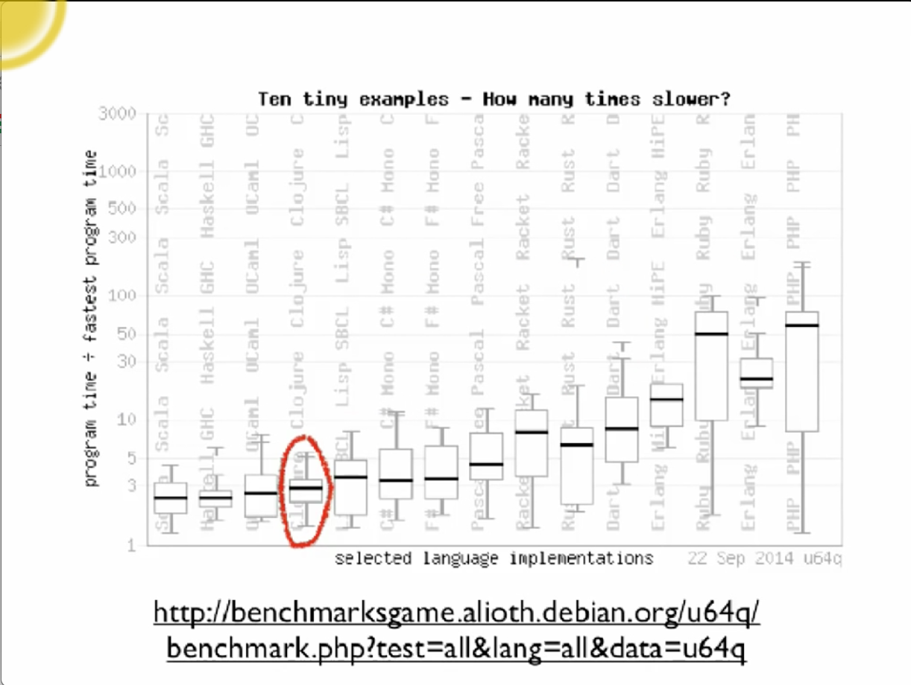
http://benchmarksgame.alioth.debian.org/u64q/benchmark.php?test=all&lang=all&data=u64q

---
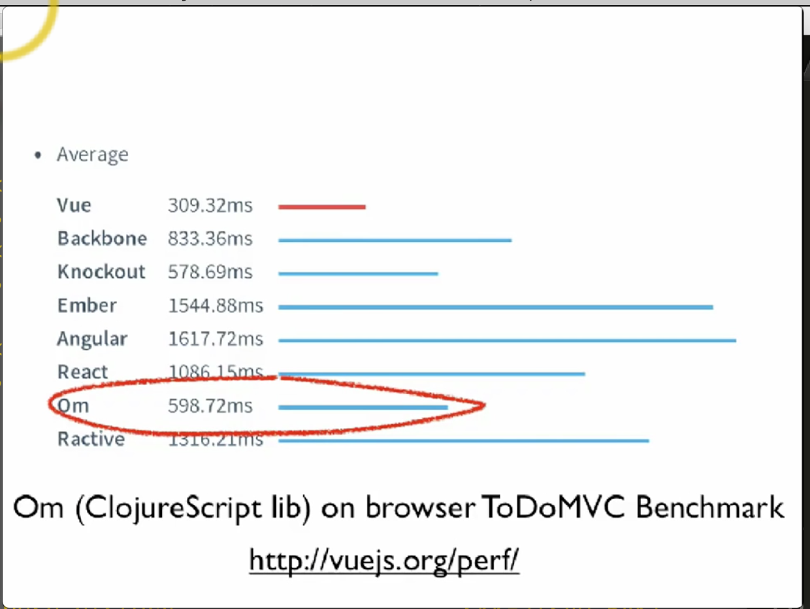
Om(ClojureScript lib) on browser ToDoMVC Benchmark
http://vuejs.org/perf/

---
Flexibility

- Ability to accommodate inevitable change
- Loose coupling is key

---
"With Clojure we get to market faster and with better quality. We avoid unintended interruptions in Java apps when code in one area impacts the application in another."

"Clojure shrinks our code base to about one-fifth the size it would be if we had written in Java."

Anthony Marcar - Senior Architect, WalmartLabs

---
"With Clojure we (get to market faster) and with (better quality). We (avoid) unintended interruptions in Java apps when code in (one area impacts) the application in (another)."

"Clojure (shrinks our code base) to about one-fifth the size it would be if we had written in Java."

Anthony Marcar - Senior Architect, WalmartLabs

---
How?

- Data orientetion
- Simplicity

What matters is not just what a programming language makes possible, but what it makes practical and idiomatic.

---
Data Processing

- Not a dirty word (nor two)
- Most programs acquire, transform, store, search, manage, transmit data
- Data is raw, immutable information
- Many langs turn into something much more elaborate - with types 'methods' etc

esp. OO conflates process constructs and information constructs

---
Data

- Clojure embraces data
- Data literals
- Code is data
- Majority of functions take/return data
- Information is represented in Clojure systems as plain data

---
Atomic Data Types

- Integers - 12345678987654
- Doubles 1.234, BigDecimals 1.234M
- Ratios - 22/7
- Strings - "fred", Characters - \a \b \c
- Symbols - fred ethel, Keywords - :fred :ethel
- Booleans - true, false, Null - nil
- Regex patterns #"a*b"

---
Data Structures

- Lists - singly linked, grow at front
  - (1 2 3 4 5), (fred ethel lucy), (list 1 2 3)
- Vector - indexed access, grow at end
  - [1 2 3 4 5], [fred ethel lucy]
- Maps - key/value associations
  - {:a 1, :b 2, :c 3}, {1 "ethel" 2 "fred"}
- Set #{fred ethel lucy}
- Everything Nests

---
Persistent Data Structures

- immutable
- Can make new 'modified' versions while keeping standard performance expectations
  i.e. not copy-on-write
- Key to practical functional programming

---
The Clojure Premise

- We can build a substantial portion of our programs using just the data structures above and pure functions thereof
- The programs will be substantially smaller, simpler and more robust than OO programs that do the same jobs
- So, we should make that idiomatic

---
Syntax

- You've just seen it (edn)
- Data structures are the code
- Not text-based syntax
  - Syntax is in the interpretation of data structures
- Things that would be declarations, control structures, function calls, operators, are all just lists with op at front
- Everything is an expression

---
edn - extensible data notation

- meant to be useful for data and code
- unlike XML and JSON

```
{
	"Fn::Base64": {
		"Fn::Join": ["", ["#!/bin/bash -ex", "\n", "\n",
		"yum install ec2-net-utils -y", "\n",
		"ec2ifup eth1", "\n",
		"service httpd start"]]
	}
}
```

---
Data as Program

```
; Norvig's Spelling Corrector in Clojure
; http://en.wikibooks.org/wiki/Clojure_programming#Examples

(defn words [text] (re-seq #"[a-z]+" (.tolowerCase text)))

(defn train [features]
   (reduce (fn [model f] (assoc model f (inc (get model f 1)))) {} features))

(def *rwords* (train (words (slurp "big.txt"))))

(defn edits1 [word]
   (let [alphabet "abcdefghijklmnopqrstuvwxyz", n (count word)]
      (distinct (concat
         (for [i (range n)] (str (subs word 0 i) (subs word (inc i))))
         (for [i (range (dec n))]
            (str (subs word 0 i) (nth word (inc i)) (nth word i) (subs word (+ 2 i))))
         (for [i (range n) c alphabet] (str (subs word 0 i) c (subs word (inc i))))
         (for [i (range (inc n) c alphabet] (str (subs word 0 i) c (subs word i)))))))

(defn known [words nwords] (for [w words :when (nwords w)] w))

(defn known-edits2 [word nwords]
   (for [e1 (edits word) e2 (edits1 e1) :when (nwords e2)] e2))

(defn correct [word nwords]
   (let [candidates (or (known [word] nwords) (known (edits1 word) nwords) (known-edits2 word nwords) [word])]
      (apply max-key #(get nwords % 1) candidates)))
```

---
Data as HTML (Hiccup DSL)

```
[:html
   [:head
      [:title title]]
   [:body
      [:h1 title]
      [:h2 (str "By" author)]
      (for [post posts]
         [:article
            [:h3 (:title post)]
            [:p (:content post)]])]]
```

---
Data as Config

```
(defproject hiccup "1.0.5"
   :description "A fast library for rendering HTML in Clojure"
   :url "http://github.com/weavejester/hiccup"
   :dependencies [[org.clojure/clojure "1.2.1"]]
   :plugins [[codox "0.7.4"]]

   :profiles
   {:1.3 {:dependencies [[org.clojure/clojure "1.3.0"]]}
    :1.4 {:dependencies [[org.clojure/clojure "1.4.0"]]}
    :1.5 {:dependencies [[org.clojure/clojure "1.5.1"]]}})
```

---
Data as Hadoop job (Netflix PigPen)

```
(defn my-data-2 []
   (->>
      (pig/load-tsv "input.tsv")
      (pig/map (fn [[a b c]]
                   {:sum (+ (Integer/valueOf a)
                            (Integer/Value of b))
                    :name c}))
       (pig/filter (fn [{:keys [sum]}] (< sum 5)))))

=> (pig/dump (my-data-2))
[{:sum 3, :name "foo"}]
```

https://github.com/Netflix/PigPen

---
More via Data...

- Type annotations
- Data schemas
- Logic DSLs
  - core.logic
  - Datalog
  - Cascalog
- Your (embedded) DSL

---
<rant> Objects are like Marionettes

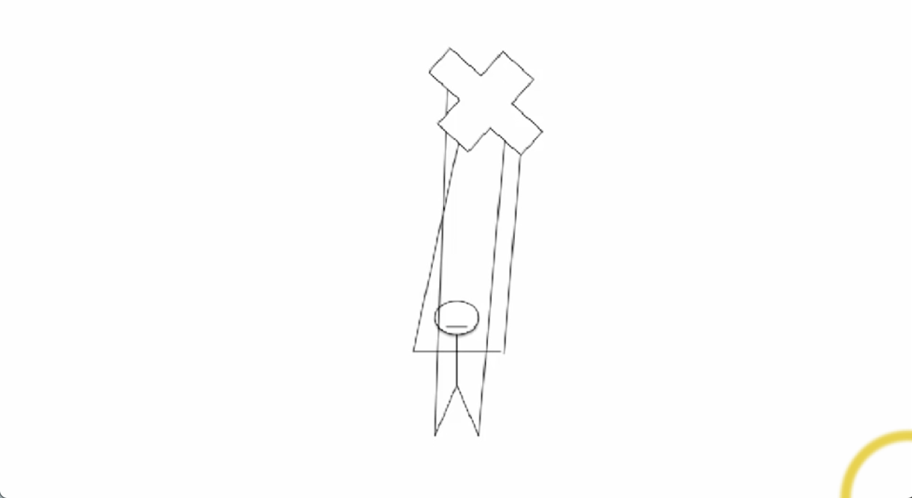

---
More Refs, More Uncertainty


---
Distribution?

- Does anyone still think RMI/DCOM/CORBA is good idea?


---
</rant>

- If your API takes an object, will it mutate?
  Does your type system help with this most important robustness aspect?
- If you wanted to refactor out-of-proc (or even onto another thread), how much work?
- Not the way the world works (ORM, O_M)
- Not the way successful systems work

---
Learning from Systems

- system - "to cause to stand"
- independent parts connected together
- computer systems
  - different langs/runtimes/types
  - RPC and queues, of plain data
- Flexible insofar as:
  - support independent development
  - tolerant in what they accept

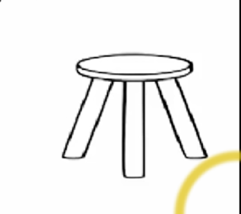

---
Outside/In

- We should program the insides of our systems like we program the outsides
  communicating via immutable data
- for the same reasons
  loose coupling/subsystem independence
  flexibility
- RPC => PC (function call)
- queues => channels

---
Process and State

- Of course there must be state and effects
- Clojure is not 'pure', but does have *explicit* state constructs
  functional succession model
  observation of state *values*
- core.async offers simple channel (queue) model flow vs places

---
(Program) Size Matters

- Smaller is better
- Bigger - more bugs, longer time to market, slower maintenance, more brittleness
- Concision - size in the small
- Generality - size in the large

---
Death by Specificity

- Most information objects are just glorified maps of name->value
- but you can't treat them as such in Java!
- more code, less reuse, more coupling
  need to access each object via its own language(class)
- this is a complete waste of time (IMO)

---
Example - HttpServletReqest

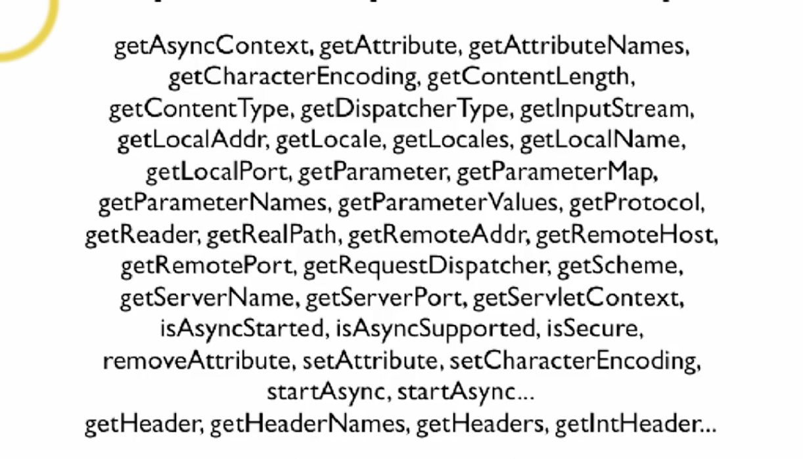

*How many maps*

---
Example - HttpServletReqest

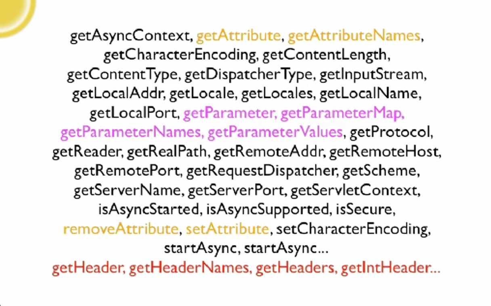

---
In Clojure, Just Use Maps

```
{:remote-addr "127.0.0.1",
 :scheme :http,
 :query-params {"somekey" "somevalue"},
 :form-params {},
 :request-method :get,
 :query-string "somekey=somevalue",
 :content-type nil,
 :uri "/foobaz",
 :server-name "localhost",
 :params {"somekey" "somevalue"},
 :headers {"accept-encoding" "gzip, deflate",
           "connection" "close",
           "user-agent" "Apache-HttpClient/4.1.2(java 1.5)",
           "content-length" "0",
           "host" "localhost:8383"},
 :content-length 0,
 :server-port 8383,
 :character-encoding nil}
```

---
Specific vs General

- Everything using HttpServletRequest is special
  - yes, dot completion works and no typos
-but everything else is much worse
  - inconsistent, idiosyncratic, wide interfaces
  - much more code - can't reuse mapmanipulation libraries
  - consumer code completely coupled
  - harder to fabricate for testing

---
Clojure Programs are Smaller

- Very concise code (in the small)
  dynamic typing
  direct support for idioms
- Very generic code (in the large)
  programming with data abstractions
  information == plain data

---
Dynamic Typing

- Yes you can have an error that a type checker would catch
  - e.g. name typos
  - likely to catch at REPL or in tests

---
Quality

- Much more important is avoiding problems that you type checker (and tests) can't catch
  - state management
  - coupling
  - lack of flexibility due to specificity
  - problems of misconception hidden in morass
- Clojure's default idioms are big net win

---
Programming is an Economic Activity

- economic - "relating to household management"
- Our programming 'house' is a mess
  full of language features, crutch tools
  secret passageways
  dirt (state)
- Languages and programs are too big
- Require large staff

---
There's Much More to Clojure

- Most of it is libraries
- that can be used independently
- Small core is protected from bloat

---
Polymorphism Made Simple

- Clojure protocols
  - set of functions polymorphic on first arg
  - Like interfaces, without inheritance
- Can be extended to existing, even final classes like java.lang.String
- Greatly reduce coupling vs derivation
- Avoid the 'privileged native framework'

---
Ecosystem and Support

- Seamless integration with host platforms
- Keep leveraging existing libs during transition
- Clojure is stable
  not an ongoing programming language experiment

---
Books

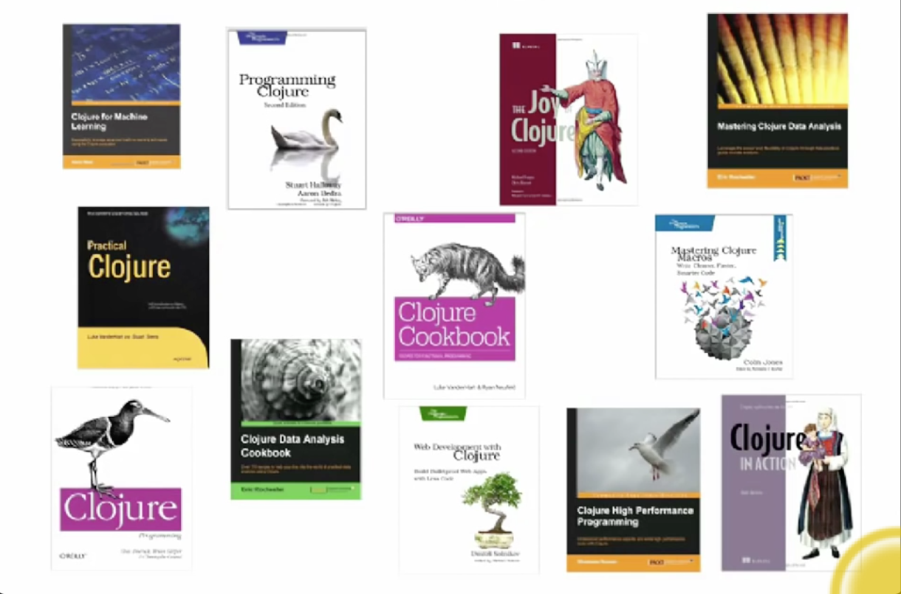

---
Tools

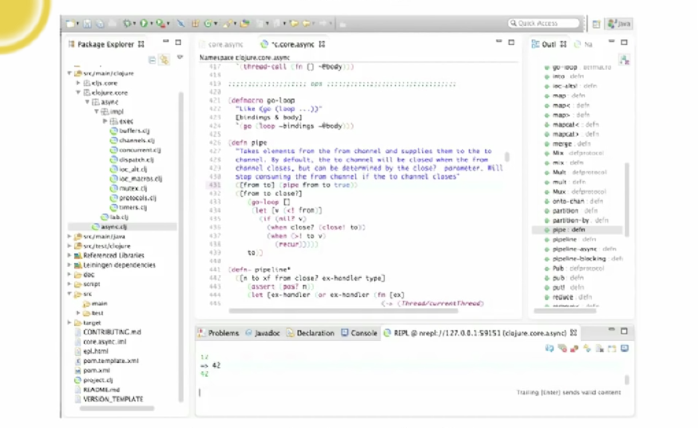

Counterclockwise for Eclipse

---
Tools

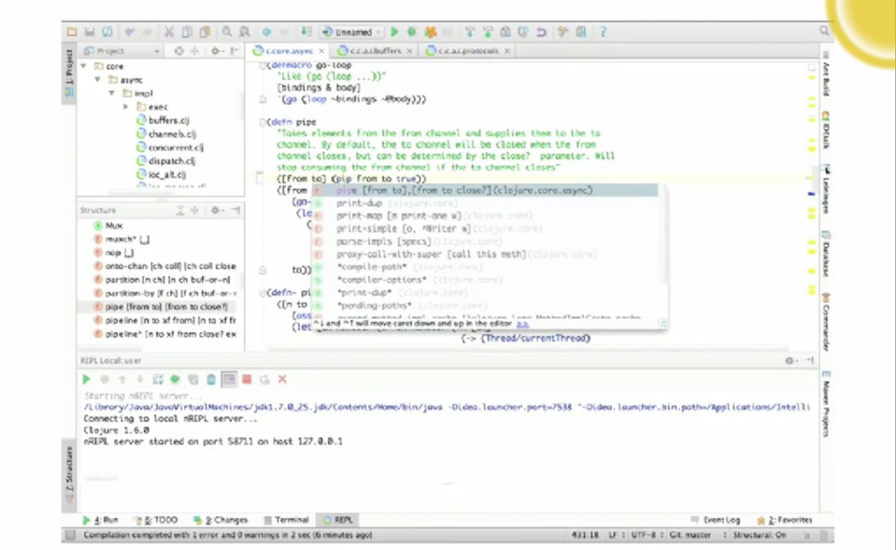

Cursive for InteliJ

---
Tools

- leiningen (build tool)
- Typed Clojure (fancy types)
- Prismatic Schema (schemas for data)
- test.check (a la QuickCheck)
- core.logic (a la Prolog)
- Immutant (interface to JBoss web stack)
- many more

---
Libraries

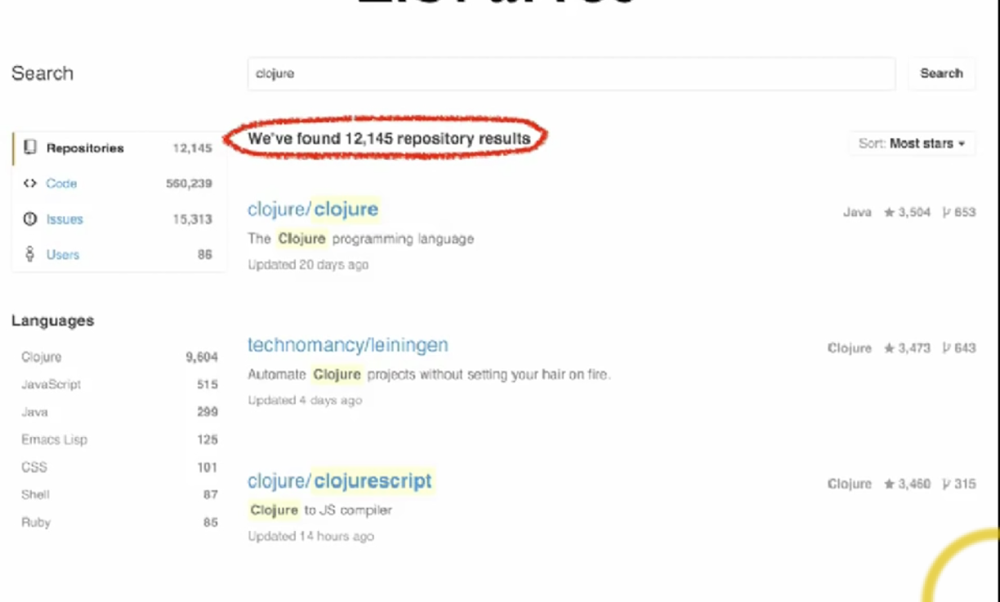

---
Users

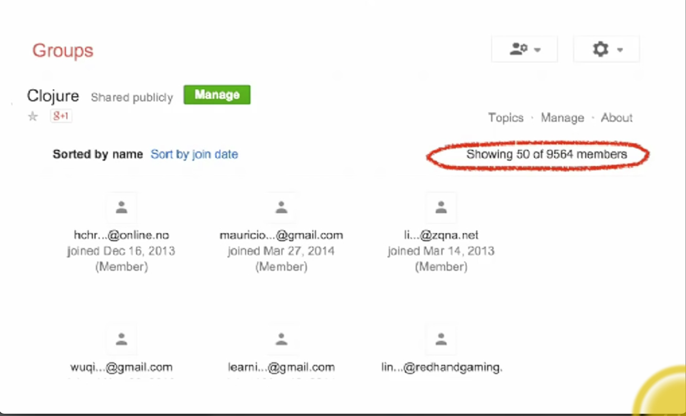

---
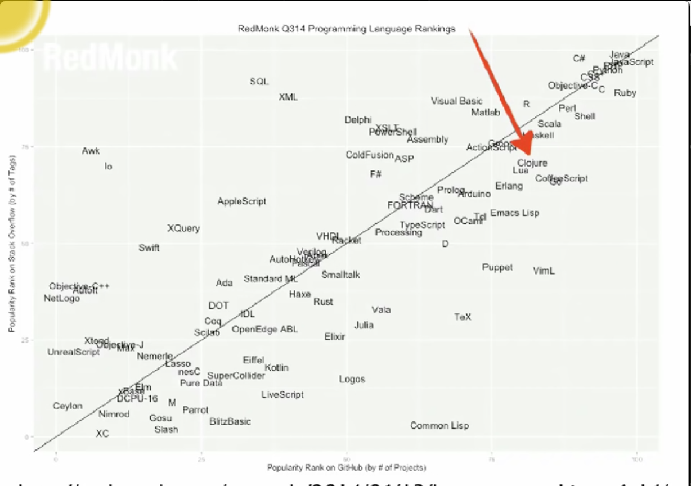

http://redmonk.com/sogrady/2014/06/13/language-rankings-6-14/

---
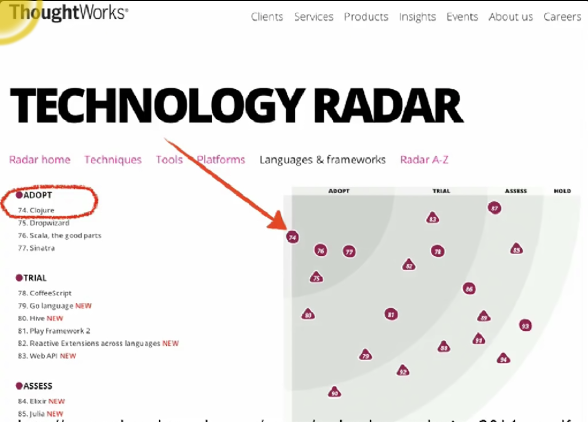

http://assets.thoughtworks.com/assets/technology-radar-jan-2014-en.pdf

---
Companies


---
Clojure

- Better and more flexible programs
- Sooner
- because Clojure is data-oriented and simple

---
