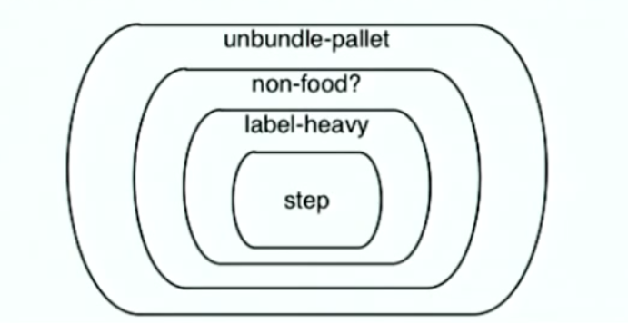
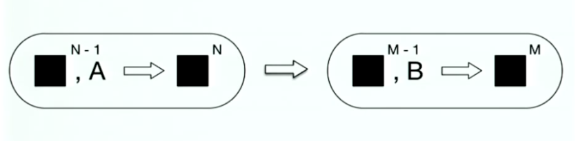
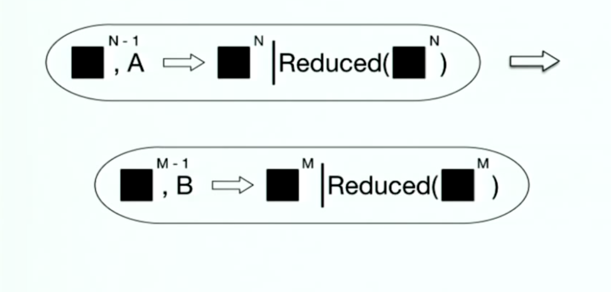
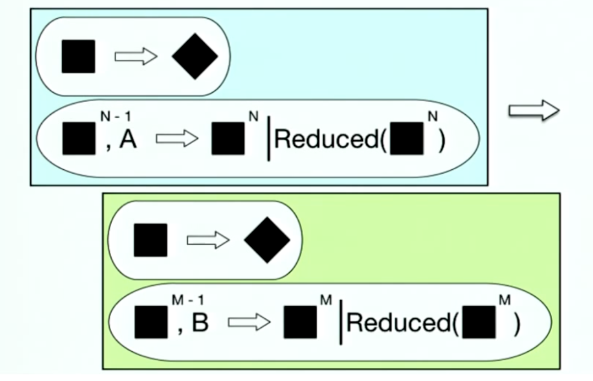
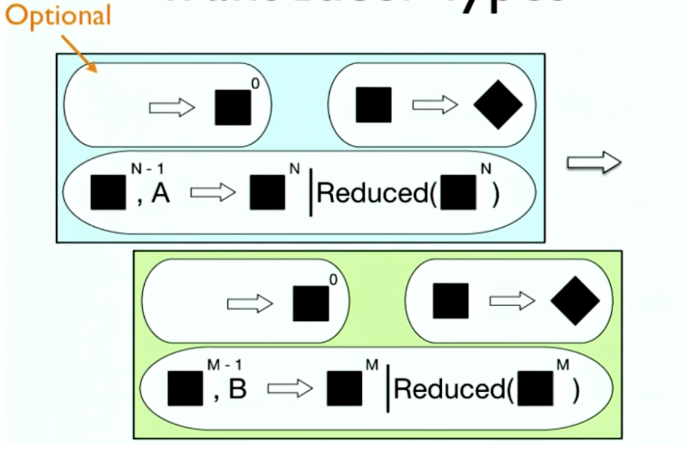
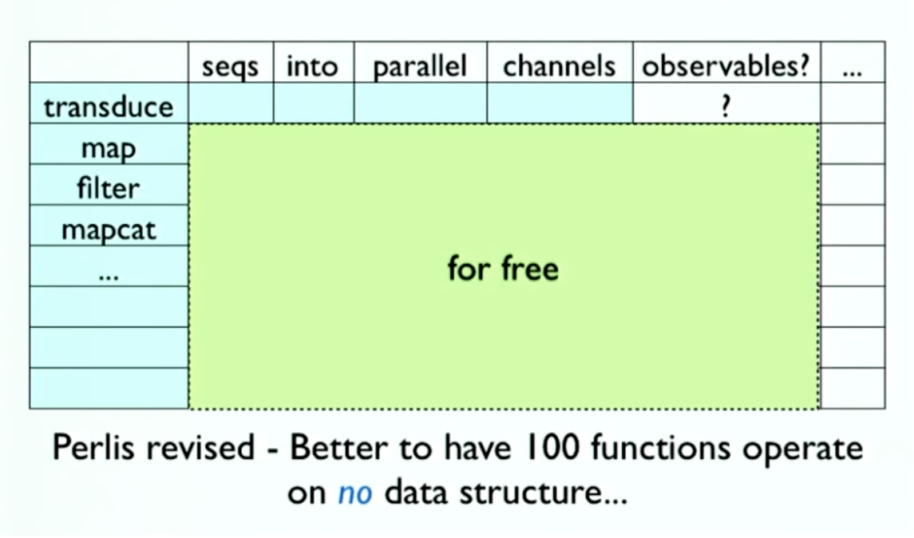

# Transducers

----

What are They?

- extract the essence of map, filter et al  map、filter等の本質を抽出する
- away from the functions that transform sequences/collections  シーケンス/コレクションを変換する関数から離れている
- so they can be used elsewhere  他の場所で使用することができます
- recasting them as process transformations  プロセス変換として再作成する

---

What Kinds of Processes?

- ones that can be defined in terms of a succession of steps 一連のステップで定義できるもの
- where each step ingests an input  各ステップで入力を取り込む
- building a collection is just one instance  コレクションを構築することは単なるインスタンスに過ぎない
- seeded left reduce is the generalization  シードされた左の削減は一般化です

----

Why 'transducer'?

- reduce
  'lead back'
- ingest
  'carry into'
- transduce
  'lead across'
- on the way back/in, will carry inputs across a series of transformations  途中で、一連の変換を介して入力を受け取ります

----

Transducers in the Real World

- 'put the baggage on the plane'  手荷物を飛行機に乗せる
- 'as you do that'  あなたがそうするように
  - break apart pallets  パレットを分解する
  - remove bags that smell like food  食べ物のようなにおいがする袋を取り除く
  - label heavy bags  ラベルの重い袋

----

Conveyances, sources, sinks are irrelevant  運送、出典、シンクは無関係です

- And unspecified  そして、不特定
- Does baggage come/go on trolleys or conveyor belts?  手荷物はトロリーやコンベアベルトに乗っていますか？

  Rules don't care

----

Transformation in the Programming World  プログラミング世界における変換

- Collection function composition:  コレクション関数の構成：

(comp
  (partial map label-heavy)
  (partial filter non-food?)
  (partial mapcat unbundle-pallet))

----

Conveyances are everywhere  運送はどこにでもあります

- map, filter, mapcat are functions of sequence -> sequence
- 'rules' only work on sequences
- creates sequences between steps

----

No reuse

- Every new collection/process defines its own versions of map, filter, mapcat et al  新しいコレクション/プロセスはすべて、独自のバージョンのmap、filter、mapcatなどを定義します
  - MyCollection -> MyCollection
  - Stream -> Stream
  - Channel -> Channel
  - Observable -> Observable ...
- Composed algorithms are needlessly specific and inefficient  合成されたアルゴリズムは、不必要に特定であり、非効率的である

----

Creating Transducers  トランスデューサの作成

(def process-bags
  (comp
    (mappcatting unbundle-pallet)
    (filtering non-food?)
    (mapping label-heavy)))
- mapcatting, filtering, mapping return transducers  
- process-bags is a transducer
- transducers modify a process by transforming its reducing function  トランスデューサは、その低減関数を変換することによってプロセスを修正する

----

Using Transducers

;; build a concrete collection
(into airplane process-bags pallets)
;; build a lazy sequence
(sequence process-bags pallets)
;; like reduce, but takes transducer
(transduce
  (comp process-bags (mapping weigh-bag))
  + 0 pallets)
;; a CSP channel that processes bags
(chan 1 process-bags)
;; it's an open system
(observable process-bags pallet-source)

----

Transducible Processes

- into, sequence, transduce, chan etc accept transducers
- use the transducer to transform their (internal, encapsulated) reducing function
- do their job with the transformed reducing function

----
Deriving Transducers

- Lectures on Constructive Functional Programming
  by R.S. Bird
- A tutorial on the universality and expressiveness of fold
  by GRAHAM HUTTON

- http://www.cs.osx.ac.uk/files/3390/PRG69.pdf
- http://www.cs.nott.ac.uk/~gmh/fold.pdf

---

Many list fns can be defined in terms of foldr

- encapsulates the recursion
- easier to reason about and transform

(defn mapr [f coll]
  (foldr (fn [x r] (cons (f x) r))
         () coll))
(defn filterr [pred coll]
  (foldr (fn [x r] (if (pred x) (cons x r) r))
         () coll))

----

Similarly, via reduce (foldl)

- returning eager, appendy vectors

(defn mapl [f coll]
  (reduce (fn [r x] (conj r (f x)))
           [] coll))
(defn filterl [pred coll]
  (reduce (fn [r x] (if (pred x) (conj r x) r))
          [] coll))
(defn mapcatl [f coll]
  (reduce (fn [r x] (reduce conj r (f x)))
          [] coll))
* We want to get rid of 'conj'

---

Transducers

- modify a process by transforming its reducing function

(defn mapping [f]
  (fn [step]
    (fn [r x] (step r (f x)))))
(defn filtering [pred]
  (fn [step]
    (fn [r x] (if (pred x) (step r x) r))))
(def cat
  (fn [step]
    (fn [r x] (reduce step r x))))
(defn mapcatting [f]
  (comp (map f ) cat))

---

reduce-based map et al redux

(defn mapl [f coll]
  (reduce ((mapping f) conj)
          [] coll))
(defn filterl [pred coll]
  (reduce ((filtering pred) conj)
          [] coll))
(defn mapcatl [f coll]
  (reduce ((mapcatting f) conj)
          [] coll))
* conj is now an argument

---

Transducers are Fully Decoupled

- Know nothing of the process they modify
  - reducing function fully encapsulates
- May call step 0, 1 or more times
- Must pass previous result as next r otherwise must know nothing of r
- can transform input arg

---

Backwards comp?

(comp
  (mapcatting unbundle-pallet)
  (filtering non-food?)
  (mapping label-heavy))

  - No, composing the transformers yields input transformations that run left->right

  

---

Transducers are Fast

- Just a stack of function calls
  - short, inlinable
- No laziness overhead
- No interim collections
- No extra boxes

---

Transducer Types, Thus Far

----

Early Termination

- Reduction normally processes all input
- Sometimes a process has just 'had enough' input, or gotten external trigger to terminate
- A transducer might decide the same

(comp
  (mapcatting unbundle-pallet)
  (taking-while non-tricking?)
  (filtering non-food?)
  (mapping label-heavy))

----

Reduced

- Clojure's reduce supports early termination via (reduced result)
- A wrapper with a corresponding test: reduced?
- And unwrap/dereference

(reduced? (reduced x)) -> true
(deref (reduced x)) -> x

----

Transducers Support reduced

- step functions can return (reduced value)
- If a transducer gets a reduced value from a nested step call, it must never call that step function again with input

(defn taking-while [pred]
  (fn [step]
    (fn [r x]
      (if (pred x)
        (step r x)
        (reduced r)))))

----
Processes Must Support Reduced

- If the step function returns a reduced value, the process must not supply any more input to the step function
- the dereferenced value is the final accumulation value
- the final accumulation value is still subject to completion (more later)

----
Transducer Types, Thus Far

----

State

- Some transducers require state e.g. take, partition-*
- Must create unique state every time they are called upon to transform a step fn
- Thus, once applied to a process, a transducer yields another (potentially statefull) process, which should not be aliased
- Pass transducers around and let processes apply them

---

A Stateful Transducer

(defn dropping-while [pred]
  (fn [step]
    (let [dv (volatile! true)]
      (fn [r x]
        (let [drop? @dv]
          (if (and drop? (pred x))
            r
            (do
              (vreset! dv false)
              (step r x))))))))

----

Completion

- Some processes complete, and will receive no more input
- A process might want to do a final transformation of the value built up
- A stateful transducer might want to flush a pending value
- All step functions must have an arity-1 variant that does not take an input

---

Completion Operation

- A completing process must call the completion operation on the final accumulated value, exactrly once
- A transducer's completion operation must call its nested completion operation, exactrly once, and return what it returns
- A stateful transducer may flush state (using the nested step function) prior to calling the nested complete*. partition-all and partition-while are examples.

---

Trausducer Types, Thus Far

---

init

- A reducing function may support arity-0, which returns an initial accumulation value
- Transducers must support arity-0 init in terms of a call to the nested init

user=> (+)
0
user=>(+ 21)
21
user=>(+ 21 21)
42

----

Transducer Types

----

Clojure Implementation

- Reducing fns are just arity 0,1,2 functions
- Transducers take and return reducing fns
- Core sequence functions's collectionless arity now returns a transducer:
  (mapping f) == (map f)
- map, mapcat, filter, remove, take, take-while, drop, drop-while, take-nth, replace, partition-by, partition-all, keep, keep-indexed, cat, dedupe, random-sample...

----

Filter, returning a Transducer

(defn filter
  ([pred]
    (fn [rf]
      (fn
        ([] (rf))
        ([result] (rf result))
        ([result input]
          (if (pred input)
            (rf result input)
            result)))))
  ([pred coll]
    (sequence (filter pred) coll)))

----

The Goal

---

Transducers

- Transducers support context-independent definitions of data transformations
- Reusable across a wide variety of contexts
- Support early termination and completion
- Composable via ordinary function composition
- Efficient
- Tasty
